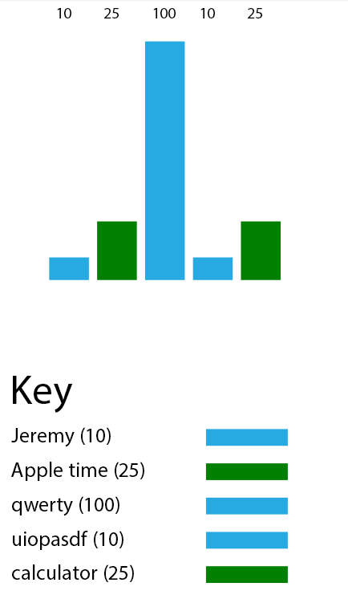

SVGChart
========
##Getting Started
First link in the jQuery:<br>
`<script type="text/javascript" src="/link/to/jquery.js"></script>`<br>
Then svgchart.min.js:<br>
`<script type="text/javascript" src="svgchart.min.js"></script>`<br>
<br>
```
<script type="text/javascript">
$(document).ready(function(){
	// 'vals' is an array. It is the values displayed on the graph.
	var vals = ["10","25","100"];

    // 'cols' is an array. It is the colo(u)rs of the crosses or bars.	Note: there must be the same amount of colo(u)rs as values in 'vals'
    var cols = ["#27AAE1","green","#27AAE1"];


    // 'lcols' is an array. It is only used on dotChart. It is the colo(u)rs of the lines. Note: there must be ONE LESS amount of colo(u)rs in 'lcols' then values in 'vals'  
    var lcols = ["pink","red"];
    var font = "MyriadPro-Regular"; // MyriadPro-Regular is the default font

    // barChart takes three required parameters and one optional (values of points/bars, colo(u)rs of points/bars, the id (#) of the element to apply the SVG inside and the font (for labels; this is optional))
    barChart(vals,cols,"chart1",font);
    
    // in addition to the parameters barChart takes dotChart can also have two optional additional parameters; they are: (to/not to display lines connection points (true/false) and an array of the colo(u)rs of the lines). 
    dotChart(vals,cols,"chart2",font,true,lcols);
	


    // This seperate function produces a key.
	var labels = ["Jeremy","Apple time","qwerty","uiopasdf","calculator"];

    // You may provide it with the same 'vals' and 'cols' arrays as the charts. Though, you will need to produce another array (of the same length) labels or names. Give it a serparate div id. 
    keyChart(vals,cols,labels,"chartKey1");

});
</script>
<div id="chart1" style="width:20%;"></div>
<div id="chart2" style="width:20%;"></div>
```
